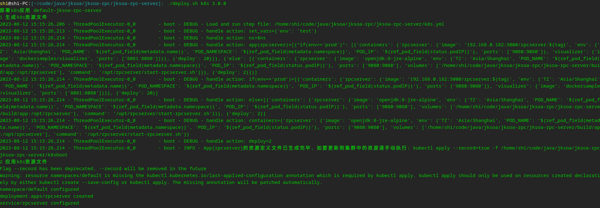
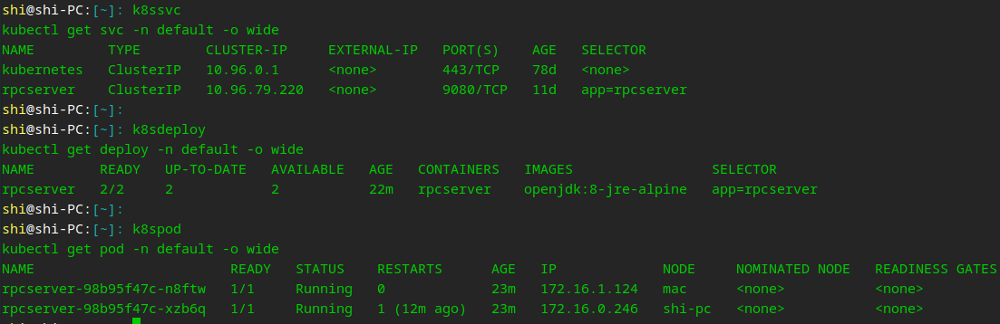

对于使用jksoa框架封装的应用部署, 可参考以下部署脚本，支持部署到k8s集群。

## 一、封装部署脚本
参考 [jksoa-rpc/jksoa-rpc-server/deploy.sh](../jksoa-rpc/jksoa-rpc-server/deploy.sh)

```sh
#!/bin/sh

# 项目目录=脚本所在目录
cd `dirname $0`
dir=`pwd`

# 导出环境变量，以便在子脚本中引用: 项目名
export pro=`basename $dir` # 项目名 = 目录名
export ns=default # k8s命名空间

# 调用部署入口脚本, 接收2个参数: 1 子命令 2 版本
../../deploy/deploy-entry.sh $*
```

## 二、部署脚本执行
### 1. 持续集成
1.1 如果仅仅构建的话:
```sh
gradle build -x test -Pall
```
 
1.2 如果有单元测试的话: 
直接使用
```sh
gradle build -Pall
```

1.3 如果要加上自动化测试: 
先搭建服务: 编译打包+上传到测试服上+启动rpc server
```sh
./deploy.sh scp 3.0.0 
```

再使用自动化测试工具(如HttpRunnerManager等)来测试

扩展: 使用jenkins来跑脚本

### 2. 持续交付
2.1 执行目录中要准备好 Dockerfile，如
```
# 先执行 gradle build -x test -Pall, 后执行: sudo docker build -t rpcserver .; sudo docker run -d --network host --name rpcserver rpcserver

# 基础镜像
FROM openjdk:8-jre-alpine

# 描述
MAINTAINER rpcserver

# 复制文件
# 由于add/copy的文件必须使用上下文目录的内容
# COPY build/app/* /opt/xx/ -- wrong: 会将子目录中所有文件复制到/opt/rpcserver/，从而错误的去掉子目录那层
COPY build/app/libs /opt/rpcserver/libs
COPY build/app/start-rpcserver.sh /opt/rpcserver/
COPY build/app/conf /opt/rpcserver/conf

# 暴露端口, 跟rpc-server.yaml端口一样
EXPOSE 9080

# 启动命令, 要一直运行，否则命令结束会导致容器结束
# CMD ["/bin/sh", "-c", "while true; do sleep 100; done"] # 让进程一直跑, 否则容器会exit
ENTRYPOINT /opt/rpcserver/start-rpcserver.sh
```

2.2 打包docker镜像, 并上传到私有仓库 192.168.0.182:5000 中
```
./deploy.sh image 3.0.0 
```

### 3. 持续部署
3.1 执行目录中要准备好 k8s.yml，要符合 [K8sBoot](https://github.com/shigebeyond/K8sBoot) 语法，如
```yaml
- ns: $ns # 命名空间
- app(rpcserver): # 应用
  - containers:
      rpcserver:
        # 这是 deliver-image.sh 打包的镜像，并上传到私有仓库192.168.0.182
        image: 192.168.0.182:5000/rpcserver:${tag}
        env: # 以dict方式设置环境变量
          TZ: Asia/Shanghai
          # 引用pod信息
          POD_NAME: ${ref_pod_field(metadata.name)}
          POD_NAMESPACE: ${ref_pod_field(metadata.namespace)}
          POD_IP: ${ref_pod_field(status.podIP)}
        ports: # 端口映射
          - 9080:9080 # 服务端口:容器端口
      visualizer:
        image: dockersamples/visualizer
        ports: # 端口映射
          - 8081:8080 # 服务端口:容器端口
  - deploy: 20 # 副本数
```

3.2 部署到k8s集群中
```sh
./deploy.sh k8s 3.0.0 
```

执行结果如下：

