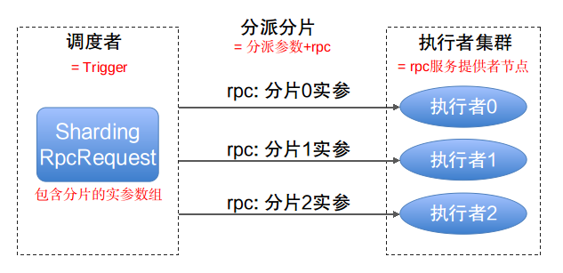

# 架构设计

## 设计思想

将作业调度与作业执行分离, 各自变化, 提高系统的整体扩展性

1. 作业调度者为 Trigger, 自身不承担业务逻辑，只负责发起调度请求。

2. 作业逻辑为 Job

3. 作业执行者, 负责接收调度请求并执行对应的Job中的业务逻辑, 根据作业不同有2类作业执行者:

3.1 如果是本地执行, 则为 Trigger自带的调度线程池;

3.2 如果是rpc执行, 则为远程服务的提供者节点.

# 组件
jksoa-job的核心组件有2个：

1. Job - 作业, 代表作业执行
2. Trigger - 触发器, 负责定时触发作业执行, 可添加/删除job, 代表作业调度

Trigger 代表作业调度, 而Job 代表作业执行, 从而实现作业调度与执行分离, 达到解耦目标

demo如下

```
import net.jkcode.jksoa.job.job.remote.RpcJob
import net.jkcode.jksoa.job.trigger.CronTrigger

// 定义job
val job = RpcJob(ISimpleService::echo, arrayOf<Any?>("测试消息"))
// 定义trigger
val trigger = CronTrigger("0/3 * * * * ?")
// 给trigger添加要触发的job
trigger.addJob(job)
// 启动trigger, 开始定时触发作业
trigger.start()
```

# 调度分析

## Trigger分类
1. `PeriodicTrigger` -- 周期性重复的触发器
2. `CronTrigger` -- cron表达式定义的触发器

## Trigger的调度线程池
调度采用线程池方式实现，避免单线程因阻塞而引起作业调度延迟。

## 调度者的HA
在 `net.jkcode.jksoa.job.cronjob.ClusterCronJobLauncher` 中实现了集群的调度者.

集群中有多个候选者节点, 但是只有选为leader的候选者节点才能成为唯一的调度者, 其他候选者节点则成为热备.

# Job执行分析

## Job分类

简单分类
1. 本地job, 本地执行, 执行者为本地线程池, 即 Trigger的调度线程池
2. rpc job, 通过rpc来执行, 执行者为远程服务提供者节点

明细分类:
1. `LambdaJob` -- 用lambda包装的作业
2. `LpcJob` -- 调用本地bean方法的作业
3. `ShardingLpcJob` -- 调用本地bean方法的分片作业
4. `RpcJob` -- 发送rpc请求的作业
5. `ShardingRpcJob` -- 发送分片rpc请求的作业

## rpc作业: RpcJob/ShardingRpcJob

基于jksoa-rpc框架来实现作业执行，作业实现由远程服务来提供, 真正的将作业执行从调度者中拆分出来。

同时由于rpc框架自身的特性, 支持故障转移, 支持失败重试

## rpc作业的HA
1. 故障转移

基于rpc框架, 调度者会感知到所有在线的服务提供者(执行者)节点, 如果某个执行节点发生故障掉线了, 则调度者会将该节点排除, 下一次调度会将请求发给其他在线的节点

2. 失败重试

基于rpc框架, 如果一次调度(rpc)请求失败, 框架会根据配置的重发次数执行重发.

## 全异步化

1. 本地作业
本地作业直接扔到调度线程池来执行, 此为异步化

2. rpc作业
基于rpc框架实现的rpc作业, rpc自身支持client端异步发请求/server端异步处理请求/client异步接收响应

相比直接在quartz的`QuartzJobBean`中执行业务逻辑，极大的降低了调度线程占用时间；

因此, 调度者的每次调度是很快的, 不会被阻塞, 能够处理海量调度, 瓶颈在于网络与服务提供者集群.

对此, 只需要增加对应服务提供者机器就行了

## 作业分片调度

为了提高作业的并行处理速度, 引入分片机制, 一个作业可拆为多个分片子作业, 框架将这些分片子作业分配给对应的多个执行者, 从而达到并行执行效果

如10台机器处理10w条数据, 分片之后, 则每台机器处理1w条数据, 并行度增加10倍, 而耗时降低10倍.

为了更简单的表达分片, 我设计的作业分片只针对`用方法调用来实现的作业`, 即包含 `LpcJob/RpcJob/ShardingLpcJob/ShardingRpcJob`, 而每个分片对应一次调用的实参数组.

因此, 所谓作业分片调度, 就是按每个分片来调度, 就是以每个分片的的实参数组来调用方法, 每个分片的调用是要分派给具体的执行者来执行.

调用过程会根据执行者有所差别:

1. 本地作业的分片
将每个分片(的实参数组)的调用, 直接扔到本地线程池执行, 因此不用管执行者数目, 直接扔到线程池执行即可
分片由线程池来统一处理, 不用管分片分派策略

2. rpc作业的分片
我直接在rpc框架中支持分片请求分发, 分片请求是 `IShardingRpcRequest`, rpc框架会按分片参数来拆分成多个请求, 并行分派给服务提供者(执行者)来执行.
此时分片分派, 要涉及到分派策略 `net.jkcode.jksoa.rpc.sharding.Ishardingstrategy`, 具体参考 [sharding_strategy](sharding_strategy.md)

分片是以执行者(服务提供者节点)为维度进行分派, 而rpc框架支持动态扩容集群, 从而动态增加执行者(服务提供者节点)数量，并行做业务处理；在进行大数据量业务操作时可显著提升作业处理能力和速度。



详细请参考 [job](job.md)

"分片作业" 和普通作业开发流程一致，不同之处在于调度作业时要指定多个分片的参数，系统自动将这些参数按分片数拆分, 分派给对应的执行者(服务提供者节点)来执行。

rpc的分片作业的创建如下:

```
// rpc的分片作业
val args:Array<Array<*>> = Array(3) { i ->
    arrayOf("第${i}个分片的参数") // IEchoService::sayHi 的实参
}
val job = ShardingRpcJob(ISimpleService::echo, args)
```

作业调度时, 先分片, 后执行, 而分片分派结果的日志输出:

```
分片分派结果, 将 3 个分片分派给 2 个节点:
net.jkcode.jksoa.rpc.client.connection.reuse.ReconnectableConnection(netty://192.168.61.183:9080) => net.jkcode.jkmvc.bit.SetBitIterator(0, 2),
net.jkcode.jksoa.rpc.client.connection.reuse.ReconnectableConnection(netty://192.168.61.184:9080) => net.jkcode.jkmvc.bit.SetBitIterator(1)
```

