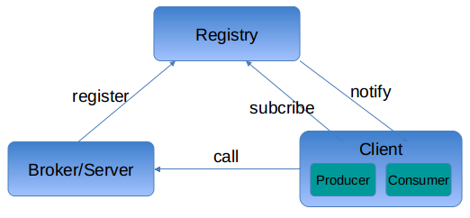

# 架构

## 3模块
1. `jksoa-mq-registry` -- 注册中心, 主要是存储与分发topic分配信息
2. `jksoa-mq-broker` -- 消息代理中心, 负责存储消息, 负责接收client的连接与请求;
3. `jksoa-mq-client` -- 消息客户端, 包含Producer(消息生产者)与Consumer(消息消费者)



## 模块依赖关系
下面依赖上面
```
jksoa-mq-registry
    jksoa-mq-client
    jksoa-mq-server
```

# 组件


## registry组件
存储topic分配信息, 就是有哪些topic, 分配给哪台broker节点
待分配的broker节点, 就是服务`IMqBrokerService`的提供者节点

## broker/server端组件
1. `BrokerLeader`: 消息代理中心的领导者, 负责注册主题, 实际上将主题分配给broker. 由于该分配操作影响消息全局存储, 不能让client端来任意分配, 因此只能在leader中分配
2. `Broker`: 消息代理中心, 负责存储消息

## client端组件
`Producer` : 消息生产者, 注册Topic, 并向该Topic生产消息;
`Consumer` : 消息消费者, 订阅主体, 能消费该Topic下的消息;


## 调用关系
如图示, 详见 [mq-flow](mq-flow.md)

## 分层

```
```

# 特性
