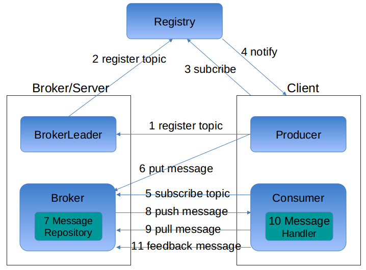

# 服务调用流程

## 注册与订阅主题的流程

1. `Producer`向`BrokerLeader`注册主题

2. `BrokerLeader`向注册中心注册主题, 注册中心会将主题分配给broker节点.

3. `Broker`与`Client`订阅注册中心

4. 注册中心向`Broker/`Client`推送最新的主题分配信息

其中`Broker`节点发现有新的主题分配给自己的话, 则初始化该主题相关的消息存储

## 消息生成与消费流程

5. `Consumer`向`Broker`订阅主题

其中broker节点的路由是根据注册中心推送过来的主题分配信息来做的

同时, 添加绑定主题相关的消息处理者`IMessageHandler`

6. `Producer`请求`Broker`来生产消息, 其中broker节点的路由是根据注册中心推送过来的主题分配信息来做的

7. `Broker`收到`Producer`发过来的消息, 并调用`MessageRepository`来存储消息

8. `Broker`根据主题将消息推送给相关的订阅的`Consumer`.

9. `Consumer`主动向`Broker`拉取消息

10. `Consumer`收到消息后, 调用`IMessageHandler`来消费消息

11. `Consumer`消费消息后, 向`Broker`反馈消费结果