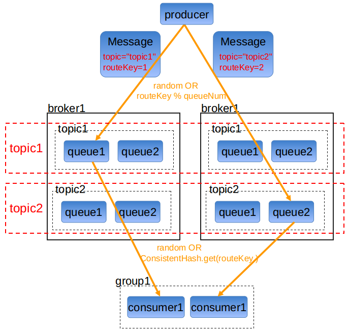

# Ordered Message -- 有序消息

有序消息, 指的是可以按照消息的发送顺序来消费, 即生产顺序=消费顺序.

jksoa-mq也可以保证从生产到消费的过程中消息有序, 他是通过在每个环节的参与方中选择固定的一个参与者来实现的, 因为每个环节的参与者只有一个, 没有并行, 因此可以保证串行, 从而保证消息有序.

即固定一个队列来存储消息, 固定一个消费者来消费消息.

按照[消息路由](route.md)的规则, 需要以下几个环节之间进行配合



## 1 生产消息时的有序

### 1.1 主题内, 选择固定的队列

默认情况下, 消息生产是会采用随机的方式选择发送的队列, 但是我们可以通过设置`routeKey`(必须大于0)的方式来选择固定的队列:

选中的是 `routeKey % queueNum` 序号的队列

### 1.2 选择固定的发送线程

远程服务的`BrokerService`的连接为单一连接, 对应是单线程发送, 不是多线程就不用选择线程.

## 2 消费消息时的有序

### 2.1 分组内, 选择固定的消费者

1. 拉模式

因为单个队列单个分组下的pull consumer是唯一, 并且他处理的是整个队列的消息, 没有并行, 因此可以保证串行, 从而保证消息有序.

2. 推模式

单个分组下, 默认是采用随机的方式选择要推送的push consumer, 但是我们可以通过设置`routeKey`(必须大于0)的方式来选择固定的push consumer:

选中的是 `ConsistentHash.get(routeKey)` 索引的push consumer

### 2.2 选择固定的消费线程

consumer收到消息后调用`IMessageHandler`来处理, 同时`IMessageHandler.concurrent`属性控制是多线程并发处理, 还是单线程串行处理

我们只需要在创建`IMessageHandler`实例时, 指定`concurrent`为false, 即能保证当前主题下是单线程处理的

### 2.3 消费异常的处理

1. 推模式

当push consumer消费某个消息出错后, broker会继续推送下一个消息, 不会暂停.

2. 拉模式
当pull consumer消费某个消息出错后, pull consumer默认会继续定时拉取下一批消息来消费, 不会暂停.

如果你的业务场景是要求严格有序的话, 则一旦消费某个消息出错了, 就不能继续消费下一个消息.

此时你可以在`IMessageHandler.consumeMessages(msgs)`的实现中, 抛出异常`MqPullConsumeSuspendException`, 系统捕获到该异常, 会暂停拉取定时器, 暂停时间在`MqPullConsumeSuspendException.suspendSeconds`属性中指定, 等过了暂停时间会重新启动拉取定时器. 

当然, 你也可以直接使用 `IMessageHandler` 的子类 `SerialSuspendablePullMessageHandler`, 他自动将业务异常转为`MqPullConsumeSuspendException` 异常, 让你不用关心如何暂停的细节.

`SerialSuspendablePullMessageHandler` 实现如下:

```
package net.jkcode.jksoa.mq.consumer.suspend

import net.jkcode.jksoa.mq.common.Message
import net.jkcode.jksoa.mq.consumer.IMessageHandler

/**
 * 串行的可暂停的拉模式的消息处理器
 *    只用于拉模式的消费者上: MqPullConsumer
 *
 * @author shijianhang<772910474@qq.com>
 * @date 2019-08-05 6:44 PM
 */
abstract class SerialSuspendablePullMessageHandler(
        public val exceptionSuspendSeconds: Int // 异常时暂停的秒数
): IMessageHandler(false) {

    init{
        if(exceptionSuspendSeconds <= 0)
            throw IllegalArgumentException("异常时暂停的秒数不是正整数: $exceptionSuspendSeconds")
    }

    /**
     * 消费处理
     * @param msgs 消息
     */
    public override fun consumeMessages(msgs: Collection<Message>){
        try{
            doConsumeMessages(msgs)
        }catch(e: Exception){
            // 封装暂停的异常
            throw MqPullConsumeSuspendException(exceptionSuspendSeconds, e)
        }
    }

    /**
     * 真正的消费处理
     * @param msgs 消息
     */
    public abstract fun doConsumeMessages(msgs: Collection<Message>)
}
```

## demo

下面用订单进行示例。一个订单的顺序流程是：创建、付款、推送、完成。订单号相同的消息会被先后发送到同一个队列中，消费时，同一个OrderId获取到的肯定是同一个队列。

### 消息生产代码

1. 生产者注册主题

```
// 注册主题
val topic = "topic1"
val b = MqProducer.registerTopic(topic)
if (!b)
    throw MqClientException("没有broker可分配")
println("注册主题: $topic")
```

2. 生产者生产消息

```
// 订单实体类
data class Order(public val id: Long, public val desc: String)

val topic = "topic1"
val group = "default"
// 订单所有状态
val states = arrayOf("创建", "付款", "推送", "完成")
val id = 1L
for(state in states){
    // 创建订单
    val order = Order(id, state + " - " + Date().format())
    // 生产消息
    // val msg = Message(topic, order.toString(), group) // 随机发给topic下的队列, 然后每个group随机发给group下的push consumer
    val msg = Message(topic, order.toString(), group, order.id /* routeKey */) // 按routeKey(订单号)固定发给topic下的队列, 然后每个group按routeKey(订单号)固定发给group下的push consumer
    MqProducer.send(msg).get()
}
```

## 消息消费代码

1. 配置

vim consumer.yaml

```
# 消息消费者配置
group: "default" # 消费者分组
pullPageSize: 100 # 每次拉取的消息数
pullTimerSeconds: !!java.lang.Long 60 # 定时拉取的时间间隔, Long类型，单位秒
threadNum: 10 # 消费处理的线程数
```

2. 消费者注册分组

```
// 注册消费者分组
val group = "default"
MqSubscriber.registerGroup(group)
println("注册消费者分组: $group")
```

3. 消费者订阅主题

```
// 并发的消息处理器
/*
val handler = object: IMessageHandler(true /* 是否并发处理 */ ) {
    override fun consumeMessages(msgs: Collection<Message>) {
        println("收到消息: $msgs")

        val fraction = 10
        if(randomInt(fraction) == 0)
            throw Exception("消费消息触发 1/${fraction} 的异常")
    }
}
*/

// 串行的可暂停的拉模式的消息处理器
val handler = object: SerialSuspendablePullMessageHandler( 120 /* 异常时暂停的秒数 */ ) {
    override fun doConsumeMessages(msgs: Collection<Message>) {
        val name = Thread.currentThread().name
        println("线程[$name]于${Date().format()} 收到消息: $msgs")

        val fraction = 10
        if(randomInt(fraction) == 0)
            throw Exception("消费消息触发 1/${fraction} 的异常")
    }
}

// 订阅主题
MqPullConsumer.subscribeTopic(topic, handler)
```

## 总结

jksoa-mq的顺序消息需要满足2点：
1. Producer端保证发送消息有序，根据routeKey发送到固定的一个队列。
2. Consumer端拉模式消费, 对指定队列按单线程串行消费。

