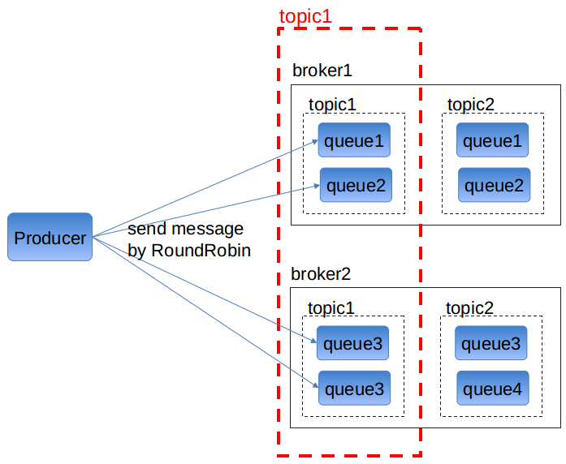

# 主题的队列 Topic's queue

在 jksoa-mq 的设计中, 主题的队列的概念, 代表该主题下的一部分消息的存储, 关键是部分消息, 因此队列变成主题的更小单元, 从而提升单个主题下存储能力与消费能力的扩展性.

目前只支持一个主题只有一个队列.

后续支持一个主题有多个队列, 也就有多个存储, 类似于kafka的partition, 或rocketmq的queue.

队列 = topic + broker + 队列id

下面论述一下单主题多队列的设计思路

## 主题的分配

主题的分配, 变为主题下多个队列的分配

1. 主题有几个队列, 可在注册主题时多添加队列数参数 `queueNum`

2. 主题下的多个队列, 要均匀分配所有broker, 分配情况也做成json存到zookeeper中, 其实跟主题级别的分配思路是一样的

因此, 原来一个主题对应一个broker, 变为对应多个broker

## 消息的生产

由于一个主题有多个队列, 因此消息的发送需要选择队列, 从而选择broker

1. 如果routeKey = 0:
随便选择队列来发送

2. 如果routeKey > 0:
通过 `routeKey % queueNum` 来选择指定序号的队列

## 主题的订阅

1. `MqPushConsumer`订阅主题
由于一个主题有多个broker, 因此由原来的向单个broker建立连接, 变成向多个broker建立连接

=> 提升存储能力的扩展性

2. `MqPullConsumer`订阅主题

原来: 对 "$group/$topic" 加锁, 加锁了才能消费

变为: 在 "$group/$topic" 建顺序节点, 获得节点的序列号. 定时拉取时, 遍历主题的每个队列, 以队列序号为key, 以节点序列号为真实节点, 做一致性hash选择, 如果选中的是当前pull consumer的序列号, 则执行拉取.

=> pull consumer做序列号 + 按一致性hash来给pull consumer分配队列

=> 因为pull consumer是处理整个队列的消息, 因此不需要在消息层次根据routeKey再做路由

=> 提升并行消费的扩展性

如果pull consumer数超过队列数, 则代表多出的pull consumer空闲, 但多主题下就不一定空闲了

## 消息的消费

拉模式下的消费不用说了

推模式下的消费, 需要明确队列所在的broker要将消息发给指定分组下的哪个push consumer, 不过这个跟单主题多队列无关, 直接维持原来的逻辑就行

1. 如果routeKey = 0:
随便选择consumer来推送

2. 如果routeKey > 0:
以routeKey为key, 以订阅的push consumer连接作为真实节点, 做一致性hash来选择push consumer

=> 按一致性hash来给消息分配push consumer