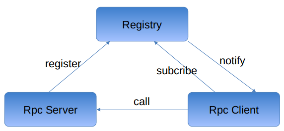

# 名词解释

1. Server, Provider节点, 容纳多个Provider
2. Client, 与Server相对, Referer通过Client来请求Server

# 架构

## 3模块
1. `jksoa-rpc-server` 服务端: 服务提供者的节点, 即`Provider`所在的节点, 管理`Provider`, 处理client的请求, 调用对应的`Provider`来处理请求
2. `jksoa-rpc-client` 客户端: 管理`Referer`, 管理与server的连接, 向server发送请求
3. `jksoa-rpc-k8s-discovery` k8s集群的服务发现



## 模块依赖关系
下面依赖上面
```
jksoa-rpc-registry
    jksoa-rpc-client
        jksoa-rpc-server
```

# 组件


## registry组件
存储服务节点注册信息, 就是有哪些服务, 服务有哪些提供者节点

服务提供者将服务信息（包含协议、ip、端口等信息）注册到注册中心，服务引用方通过注册中心发现服务节点。当服务节点发生变更，注册中心负责通知各个引用者。

## server端组件
1. `RpcRequestHandler` 请求处理器
2. `Provider` 暴露服务的服务提供者, 将服务注册到注册中心, 调用的是服务实现.
3. `ServiceImpl` 服务实现, 要被`Provider`调用. 由于被`Provider`注册到注册中心, 因此可被调用方调用.

## client端组件
1. `Referer` 调用远程服务的服务引用者, 即服务调用者, 调用的是服务代理
2. `ServiceProxy` 服务代理, 简化调用, 调本地服务一样调远程服务, 使用`RpcInvocationHandler`来实现
3. `RpcInvocationHandler` 将方法调用封装为请求, 并通过 `RpcRequestDispatcher` 来分发请求
4. `RpcRequestDispatcher` 分发请求
5. `ConnectionHub` 连接集中器, 通过订阅注册中心来发现服务节点, 同时用于管理单个服务的一组server的连接, 发送请求时会根据不同的负载均衡策略选择一个可用的Server发送。
6. `LoadBalancer` 均衡负载器, 用于均衡发送请求给某服务的多个server(即服务提供者节点)中的某个.
7. `Connection` 单个连接, 即与server的连接, 用于向server发送请求

## 公共组件
1. `Serializer` 序列器, 用于编码解码请求与响应.

## 调用关系
如图示, 详见 [rpc-flow](rpc-flow.md)

## 分层

```
└── net
    └── jkcode
        └── jksoa
            └── rpc
                ├── client 客户端
                │   ├── connection 连接管理, 包含 ConnectionHub 实现
                │   ├── dispatcher 请求分发, 包含 RpcRequestDispatcher 实现
                │   ├── protocol 协议的客户端实现, 包含 IRpcClient/IConnection 实现
                │   └── referer 服务引用者, 生成与获得服务代理, 包含 Referer/ RpcInvocationHandler 实现
                ├── loadbalance 均衡负载
                ├── sharding 请求分片
                ├── registry 注册中心
                └── server 服务端
                    ├── handler 请求处理器, 包含 RpcRequestHandler 实现
                    ├── protocol 协议的服务端实现, 包含 IRpcServer 实现
                    └── provider 服务提供者, 生成服务实现实例与注册服务, 包含 Provider 实现
```

# 特性

## 健壮性
1. 注册中心对等集群，任意一台宕掉后，将自动切换到另一台
2. 注册中心全部宕掉后，服务提供者和服务引用者仍能通过本地缓存通讯
3. 服务提供者无状态，任意一台宕掉后，不影响使用
4. 服务提供者全部宕掉后，服务引用者应用将无法使用，并无限次重连等待服务提供者恢复

## 伸缩性
1. 服务提供者无状态，可动态增加机器部署实例，注册中心将推送新的服务提供者信息给引用者
