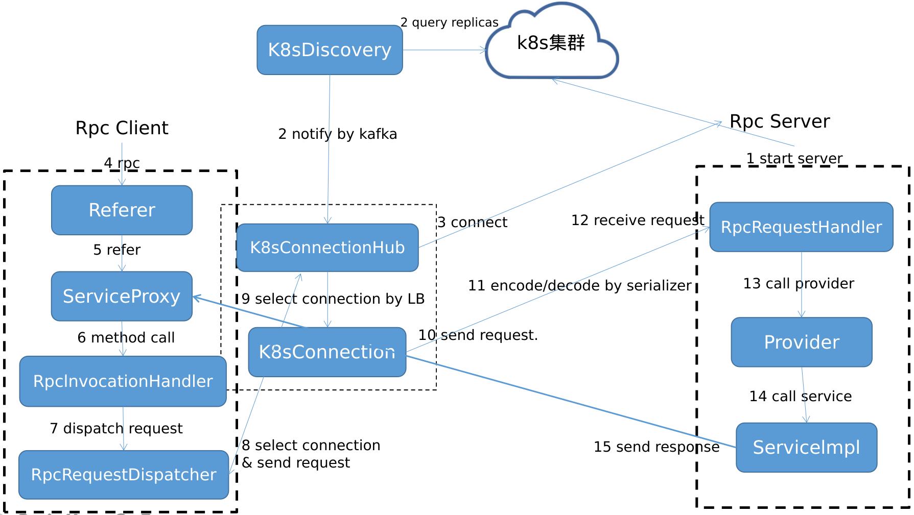

# 名词解释

1. Server, Provider节点, 容纳多个Provider
2. Client, 与Server相对, Referer通过Client来请求Server

# 架构

## 3模块
1. `jksoa-rpc-server` 服务端: 服务提供者的节点, 即`Provider`所在的节点, 管理`Provider`, 处理client的请求, 调用对应的`Provider`来处理请求
2. `jksoa-rpc-client` 客户端: 管理`Referer`, 管理与server的连接, 向server发送请求
3. `jksoa-rpc-k8s-discovery` k8s集群的服务发现

## 模块依赖关系
下面依赖上面
```
jksoa-rpc-registry
    jksoa-rpc-client
        jksoa-rpc-server
```

# 组件



## k8s服务发现组件
`K8sDiscovery`定时查询k8s应用的节点数，并广播应用节点数mq

## server端组件
1. `RpcRequestHandler` 请求处理器
2. `Provider` 暴露服务的服务提供者, 要调用服务实现. 服务节点通过包名到k8s应用域名(server)的映射约定来定位, 从而被调用方调用。

## client端组件
1. `Referer` 调用远程服务的服务引用者, 即服务调用者, 调用的是服务代理
2. `ServiceProxy` 服务代理, 简化调用, 调本地服务一样调远程服务, 使用`RpcInvocationHandler`来实现
3. `RpcInvocationHandler` 将方法调用封装为请求, 并通过 `RpcRequestDispatcher` 来分发请求
4. `RpcRequestDispatcher` 分发请求
5. `K8sConnectionHub` 连接集中器, 用于管理k8s应用的一组server的连接, 发送请求时会根据不同的负载均衡策略选择一个可用的Server发送。
6. `LoadBalancer` 均衡负载器, 用于均衡发送请求给某服务的多个server(即服务提供者节点)中的某个.
7. `K8sConnection` 单个连接, 即与k8s应用pod的连接, 用于向pod发送请求

## 公共组件
1. `Serializer` 序列器, 用于编码解码请求与响应.

## 调用关系
如图示, 详见 [rpc-flow](rpc-flow.md)

## 分层

```
└── net
    └── jkcode
        └── jksoa
            └── rpc
                ├── client 客户端
                │   ├── connection 连接管理, 包含 K8sConnection 与 K8sConnectionHub 实现
                │   ├── dispatcher 请求分发, 包含 RpcRequestDispatcher 实现
                │   ├── protocol 协议的客户端实现, 包含 IRpcClient/IConnection 实现
                │   └── referer 服务引用者, 生成与获得服务代理, 包含 Referer/ RpcInvocationHandler 实现
                ├── loadbalance 均衡负载
                ├── sharding 请求分片
                └── server 服务端
                    ├── handler 请求处理器, 包含 RpcRequestHandler 实现
                    ├── protocol 协议的服务端实现, 包含 IRpcServer 实现
                    └── provider 服务提供者, 生成服务实现实例, 包含 Provider 实现
```

# 特性

1. 整合k8s超强的容器编排能力: 支持自动装箱、自我修复、水平扩容、服务发现、滚动更新、版本回退、密钥和配置管理、存储编排、批处理;
2. 健壮性: 服务提供者无状态，任意一台宕掉后，服务引用者会自动重连(会伴随0~1次请求失败)，框架自身也支持异常重发，基本上不影响服务引用者调用;
当服务提供者全部宕掉后，服务引用者应用将无法使用，并持续重连等待服务提供者恢复;
3. 伸缩性: 服务提供者无状态，方便用k8s来扩容.
