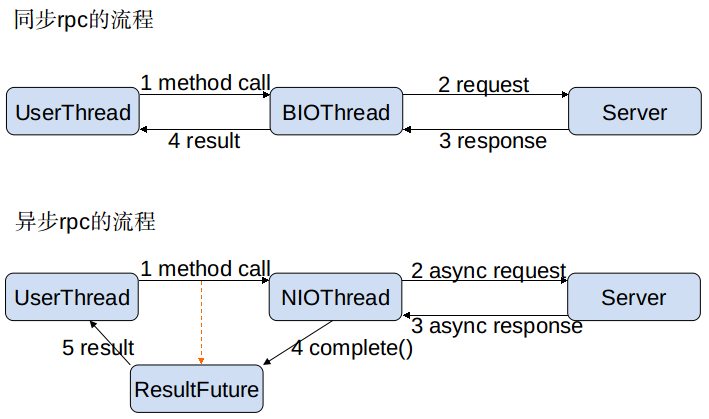

# 异步调用

jksoa-rpc 的异步编程接口都是基于 `CompletableFuture` 来实现的.

## 异步调用流程
基于 NIO 的非阻塞实现并行调用，客户端不需要启动多线程即可完成并行调用多个远程服务，相对多线程开销较小。



## 使用CompletableFuture返回类型的接口
需要服务提供者事先定义CompletableFuture返回类型的服务，具体参见服务端异步执行接口定义：

```
public interface IGuardService {
  fun getUserByIdAsync(id: Int): CompletableFuture<User>
}
```

注意接口的返回类型是`CompletableFuture<User>`。

调用远程服务：

```
val service = Referer.getRefer<IGuardService>()
// 调用直接返回CompletableFuture
val future = service.getUserByIdAsync(1)
// 增加完成后回调
future.whenComplete { r, ex ->
    print("调用服务[IGuardService.getUserByIdAsync()]")
    if(ex == null)
        println("成功： $r")
    else
        println("异常: $ex" )
}
// 早于结果输出
println("Executed before response return.");
```
