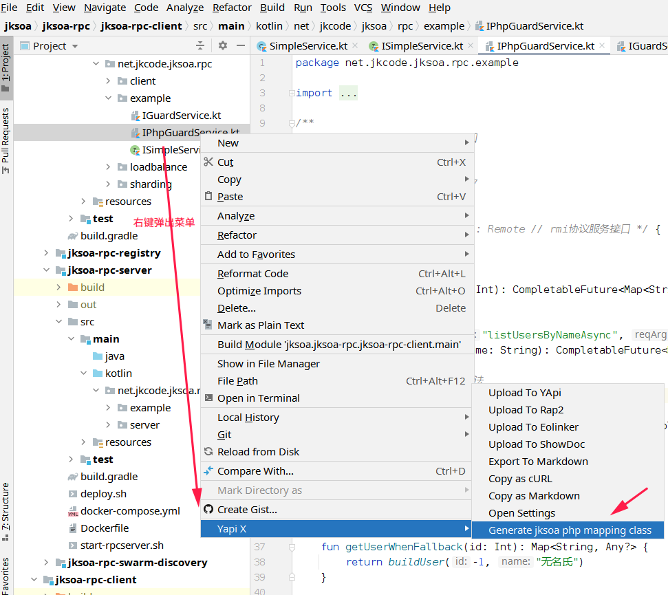
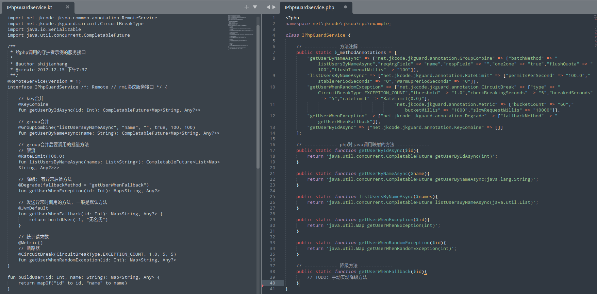

# 概述
jksoa-rpc-client 整合jphp技术, 支持同构异语言(java/php), 以便支持更多的动态性, 如直接用php来调用rpc

# 实现
## 1. WrapJavaReferer
包装服务的java引用对象, 以便在php中进行rpc调用

php调用如下：
```php
<?php
use php\jksoa\rpc\JavaReferer;

// 打印rpc的调用+结果
function print_rpc($ref, $ret){
   if(is_array($ret))
      $ret = print_r($ret, true);
   echo "----------- php rpc call [{$ref->getLastCall()}], result: $ret\n";
}

// 创建java引用对象: 工程中必须存在类 net.jkcode.jksoa.rpc.example.ISimpleService
$ref = new JavaReferer('net.jkcode.jksoa.rpc.example.ISimpleService');

// rpc: php代理调用java对象
$ret = $ref->hostname();
print_rpc($ref, $ret);
```

等价于java/kotlin的调用，实际上`WrapJavaReferer`意义就是php代理调用java对象
```
// 获得服务引用者(stub)
val service = Referer.getRefer<ISimpleService>()
// 调用服务引用者, 实际调用的是远程方法, 但跟调用本地方法一样简单
val ret = service.hostname()
```

## 2. WrapPhpReferer
包装服务的php引用对象(PhpReferer), 以便在php中进行rpc调用, 借助php的动态性, 我们可以动态的升级rpc服务接口, 不用再重新将java服务接口打包到应用里并重新发布, 大大的减少应用的发布与重启的频率。

- 1 根据java服务接口来生成php映射类

我们安装并使用idea插件[jk-yapix](https://plugins.jetbrains.com/plugin/19338-jk-yapix) 来生成php映射类



- 2 java服务类 vs 生成的php映射类


- 3 php调用
```
<?php
use php\jksoa\rpc\PhpReferer;

// 打印rpc的调用+结果
function print_rpc($ref, $ret){
   if(is_array($ret))
      $ret = print_r($ret, true);
   echo "----------- php rpc call [{$ref->getLastCall()}], result: $ret\n";
}

// php引用对象
include 'src/test/resources/IPhpGuardService.php'; // 引用生成的php映射类文件
$ref = new PhpReferer('net\jkcode\jksoa\rpc\example\IPhpGuardService');
// rpc: 内部调用 RpcInvocationHandler.guardInvoke(method, this, params, env) 来发送rpc请求
$ret = $ref->getUserByIdAsync(1)->get();
print_rpc($ref, $ret);
```