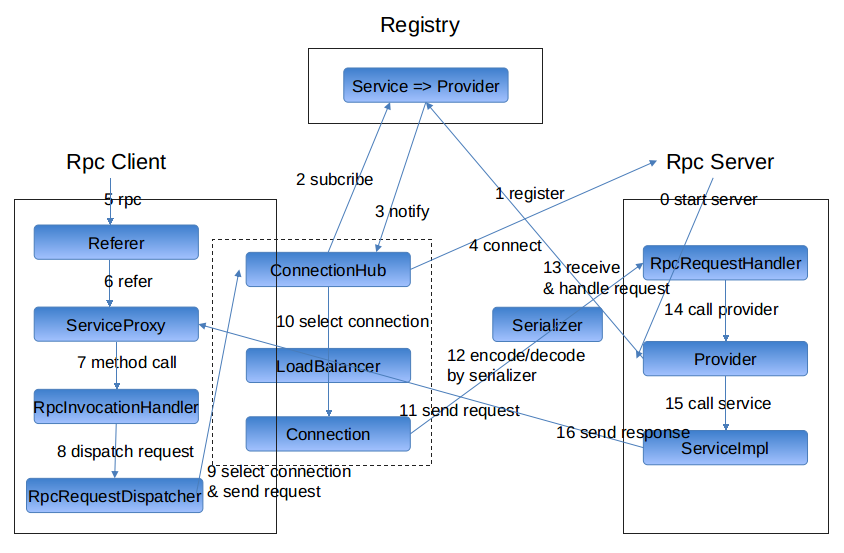

# 服务调用流程

## server启动流程

1. 启动server

2. 加载并创建服务提供者`Provider`, 创建服务实现的实例, 并向注册中心注册. 详见 `Provider.createAndRegisterService()`

3. client端的`ConnectionHub`订阅了注册中心, 注册中心向他推送最新的服务提供者节点地址

4. `ConnectionHub`收到新的服务提供者节点, 则向节点建立连接

## rpc调用流程

5. client端通过`Referer`来rpc

6. `Referer.getRefer<XxxService>` 获得服务代理, 调用代理方法即为rpc.

7. 服务代理是通过`RpcInvocationHandler`来实现的, 负责处理代理对象的方法调用.

8. `RpcInvocationHandler` 将方法调用封装为请求, 并通过 `RpcRequestDispatcher` 来分发请求

9. `RpcRequestDispatcher` 通过 `ConnectionHub` 来选择连接, 并通过连接来发送请求

10. `ConnectionHub` 使用均衡负载器来选择连接

11. 调用连接来发送请求

12. client/server端的编码解码都是通过序列化器来做

13. 经过网络传输后, server收到请求, 并调用`RpcRequestHandler`来处理请求

14. `RpcRequestHandler`根据请求指定的服务, 调用对应服务提供者`Provider`

15. 服务提供者`Provider`调用服务实现.

16. 最后将调用结果封装为响应发送给client, 作为rpc的结果.

当然包含编码解析与网络传输, 图上略过了.

### 总结

1. client端

1.1 代理调用, 封装为请求

1.2 发送请求

1.3 接收响应

2. server端

2.1 接收请求

2.2 处理请求

2.3 发送响应

## 请求与响应的映射

一般情况下，服务引用方会并发调用多个服务，每个用户线程发送请求后, 会返回 `RpcResponseFuture` 对象来等待响应回来, 可调用`get()`来阻塞等待。 一段时间后，服务引用方的IO线程会收到多个响应对象。

这个时候要考虑一个问题，如何将每个响应对象传递给相应的`RpcResponseFuture`对象，且不出错。

答案是通过请求id。

当 `RpcResponseFuture` 被创建时，会要求传入 `RpcRequest` 请求对象, 直接从 `RpcRequest` 对象中获取请求id，并将 `<请求id, RpcResponseFuture>` 映射关系存入响应映射表中。

当服务引用方的IO线程在收到 `RpcResponse` 对象后，会根据 `RpcResponse` 对象中的请求id, 从响应映射表中取出相应的`RpcResponseFuture`对象，然后再将 `RpcResponse` 对象设置到`RpcResponseFuture`对象中。

最后再唤醒用户线程，这样用户线程即可从`RpcResponseFuture`对象中获取调用结果了。

详细实现参考 `NettyRpcResponseFuture`

