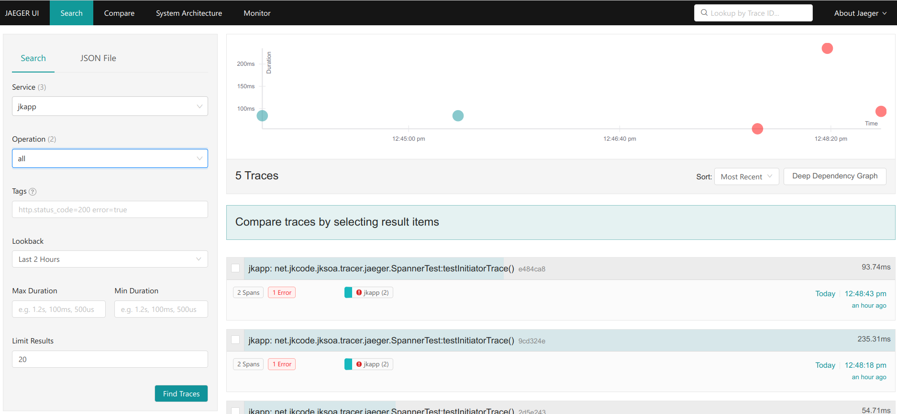

# 概述
jksoa-tracer-jaeger 是jksoa整合jaeger来做分布式跟踪，通过jaeger收集分布式服务执行时间的信息来达到追踪服务调用链路、以及分析服务执行延迟等目的。

## 特性
- 1、简单, 易用, 轻量, 易扩展；
- 2、基于拦截器实现3端的跟踪, rpc client/rpc server/http server, 已做成插件, 开箱即用
- 3、充分利用jaeger的特性：高扩展性、对OpenTracing原生支持、多种存储后端、现代化Web UI、云原生部署

## 背景
面对日趋复杂的分布式系统，如服务框架、消息中间件、缓存、数据层等，导致开发人员在业务性能瓶颈定位、故障排除等方面效率低下，没有成熟的Trace工具，需要引入分布式跟踪系统(即Trace系统)。

Trace系统需要能够透明的传递调用上下文，理解系统行为，理清后端调用关系，实现调用链跟踪，调用路径分析，帮助业务人员定位性能瓶颈，排查故障原因等；同时，需要对用户尽量透明，减少对业务代码的侵入性。

设计思想源于[Google Dapper论文](http://bigbully.github.io/Dapper-translation/)实现。


## 使用
### 添加依赖
1. gradle
```
compile "net.jkcode.jksoa:jksoa-tracer-jaeger:2.0.0"
```

2. maven
```
<dependency>
    <groupId>net.jkcode.jksoa</groupId>
    <artifactId>jksoa-tracer-jaeger</artifactId>
    <version>2.0.0</version>
</dependency>
```

### 配置 jaeger.properties
各个配置项的填写见注释
```
# jaeger配置，参考 https://www.jaegertracing.io/docs/1.35/client-features/#tracer-configuration-via-environment-variables
# 应用名 Service name
JAEGER_SERVICE_NAME=
# Hostname for communicating with agent via UDP
JAEGER_AGENT_HOST=
# Port for communicating with agent via UDP
JAEGER_AGENT_PORT=
# Traces endpoint, in case the client should connect directly to the Collector, like http://jaeger-collector:14268/api/traces
JAEGER_ENDPOINT=http://192.168.0.170:14268/api/traces
# Authentication Token to send as "Bearer" to the endpoint
JAEGER_AUTH_TOKEN=
# Username to send as part of "Basic" authentication to the endpoint
JAEGER_USER=
# Password to send as part of "Basic" authentication to the endpoint
JAEGER_PASSWORD=
# Comma separated list of formats to use for propagating the trace context. Defaults to the standard Jaeger format. Valid values are jaeger, b3, and w3c
JAEGER_PROPAGATION=
# Whether the reporter should also log the spans
JAEGER_REPORTER_LOG_SPANS=
# Reporter's maximum queue size
JAEGER_REPORTER_MAX_QUEUE_SIZE=1000
# Reporter's flush interval (ms)
JAEGER_REPORTER_FLUSH_INTERVAL=
# Sampler type： const, probabilistic, or ratelimiting
JAEGER_SAMPLER_TYPE= const
# Sampler parameter (number)
JAEGER_SAMPLER_PARAM= 1
# Host name and port when using the remote controlled sampler
JAEGER_SAMPLER_MANAGER_HOST_PORT=
# A comma separated list of name = value tracer level tags, which get added to all reported spans. Value can also refer to an environment variable using the format ${envVarName:default}, where the :default is optional, and identifies a value to be used if the environment variable cannot be found
JAEGER_TAGS=
```

### 引用插件

对rpc client/rpc server/http server等3端, 使用拦截器来埋点跟踪, 已做成插件.

配置好插件即可实现透明接入，自动拦截跨服务的调用，进行数据采样。

vim plugin.list

```
# rpc client/rpc server/http server等3端的插件
net.jkcode.jksoa.tracer.jaeger.JaegerTracerPlugin
```

### Jaeger UI效果
