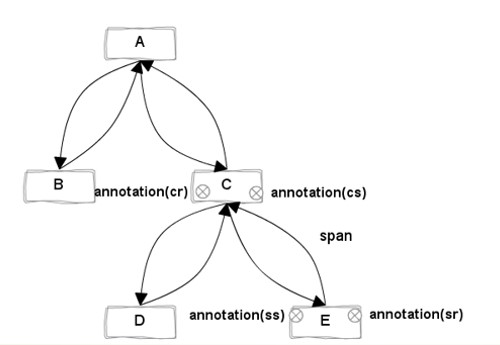
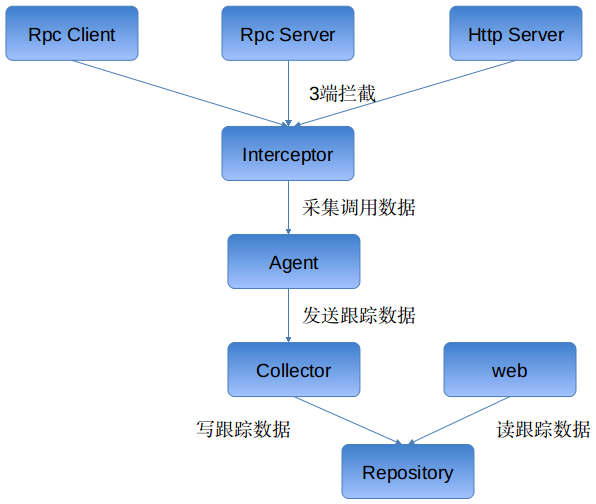

# 跟踪模型

## 跟踪组件
一次典型的分布式调用过程，如下图所示:

跟踪模型有以下组件：
1. Trace
一次完整的分布式调用跟踪链路。

2. Span
追踪服务调基本结构，表示跨服务的一次调用；多span形成树形结构，组合成一次Trace追踪记录。

3. Annotation
在span中的标注点，记录整个span时间段内发生的事件。

而Annotation类型有:
> - `Cs` CLIENT_SEND，客户端发起请求
> - `Cr` CLIENT_RECIEVE，客户端收到响应
> - `Sr` SERVER_RECIEVE，服务端收到请求
> - `Ss` SERVER_SEND，服务端发送结果
> - `Ex` Exception 记录异常事件

4. Client && Server

## 跟踪流程

# 架构

## 模块

1. `jksoa-tracer-common` 公共代码, 如跟踪模型的定义

2. `jksoa-tracer-agent` 跟踪代理人, 负责采集调用数据

2.1 基于rpc: 
构建于jksoa-rpc之上，支持应用的透明接入。

2.2 拦截器实现: 
对rpc client/rpc server/http server等3端, 使用拦截器来埋点跟踪.

2.3 采集处理: 
与CAT/hydra类似。支持自适应采样，规则简单，对于每秒钟的请求次数进行统计，如果超过100，就按照10%的比率进行采样。

2.4 上传处理:
rcp调用`ICollectorService`远程服务，批量异步上传数据

3. `jksoa-tracer-collector` 跟踪收集人, 负责收集agent上传过来来的调用数据, 并组成跟踪数据入库
提供 `ICollectorService` rpc服务, 以供agent调用

4. `jksoa-tracer-web` 用户交互界面, 读跟踪数据并显示报表. UI直接复用京东的Hydra框架

## 接入方式

1. 透明接入
对rpc client/rpc server/http server等3端, 使用拦截器来埋点跟踪, 已做成插件.

配置好插件即可实现透明接入，自动拦截跨服务的调用，进行数据采样。

2. 注解
对于其他分散的服务，或者业务逻辑中其他小粒度的埋点，如服务内部的方法调用、数据库操作、URL请求等，提供注解 `@TraceService` 的方式。

## 数据存储模块
- 目前支持存在mysql
- 通过traceId可以直接将span数据关联起来
- 通过traceId和spanId可以定位所有的Annotation数据

