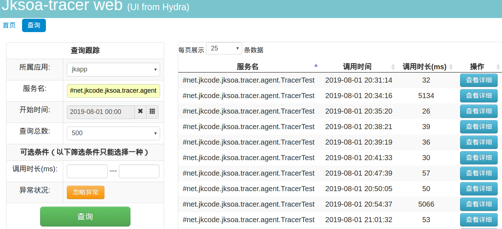
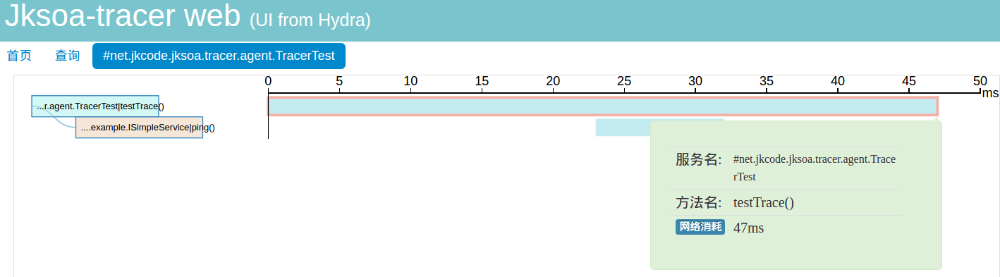

# 概述

jksoa-tracer 分布式跟踪系统, 能够将一次分布式请求还原成调用链路。显式的在后端查看一次分布式请求的调用情况，比如各个节点上的耗时、请求具体打到了哪台机器上、每个服务节点的请求状态(耗时/QPS)、在哪个环节出错等等。如此能快速定位性能瓶颈与错误出处.

## 特性

- 1、简单, 易用, 轻量, 易扩展；
- 2、基于拦截器实现3端的跟踪, rpc client/rpc server/http server, 已做成插件, 开箱即用
- 3、复用rpc框架, 基于netty实现通讯
- 4、数据可视化：做到不用看日志通过可视化进行筛选

## 背景

面对日趋复杂的分布式系统，如服务框架、消息中间件、缓存、数据层等，导致开发人员在业务性能瓶颈定位、故障排除等方面效率低下，没有成熟的Trace工具，需要引入分布式跟踪系统(即Trace系统)。

Trace系统需要能够透明的传递调用上下文，理解系统行为，理清后端调用关系，实现调用链跟踪，调用路径分析，帮助业务人员定位性能瓶颈，排查故障原因等；同时，需要对用户尽量透明，减少对业务代码的侵入性。

设计思想源于[Google Dapper论文](http://bigbully.github.io/Dapper-translation/)实现。

# 快速入门

## agent端

### 配置 agent.yaml

```
# agent配置

# 有@TraceableService注解的类所在的包路径
traceableServicePackages: #
  - net.jkcode.jksoa.tracer.agent
```

### 添加agent插件
vim plugin.yaml

```
# rpc客户端的插件
rpcClientPlugins:
    - net.jkcode.jksoa.tracer.agent.plugin.RpcClientTracerPlugin
# rpc服务端的插件
rpcServerPlugins:
    - net.jkcode.jksoa.tracer.agent.plugin.RpcServerTracerPlugin
# http服务端的插件
httpServerPlugins:
    - net.jkcode.jksoa.tracer.agent.plugin.HttpServerTracerPlugin
```

### @TraceableService注解

`@TraceableService`注解声明在要跟踪的服务类, agent启动后扫描到被注解的服务类, 然后调用`ICollectorService.syncService()`来同步服务类, 主要是让跟踪系统能识别该服务类, 同时给这个服务类一个id来作为存储要素.

## collector端

需要启动rpc server, 提供 `ICollectorService` rpc服务, 以供agent调用

## web端

在`jksoa-tracer-web`模块上启动http server, 以显示跟踪相关报表. UI直接复用京东的Hydra框架

1. 查询跟踪页面



2. 跟踪详情页面

